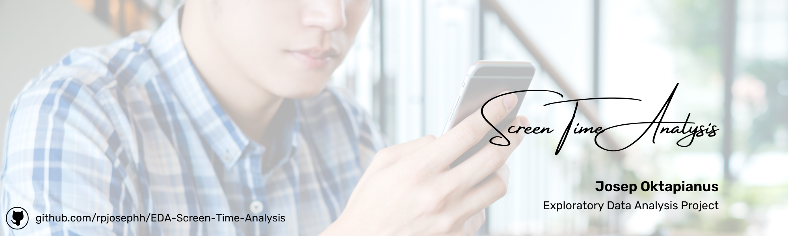

```{r setup, include=FALSE}
knitr::opts_chunk$set(echo = TRUE, warning = FALSE, message = FALSE)
```

<style>
/* Justify text alignment for paragraphs */
p {
  text-align: justify;
  text-justify: inter-word;
}

/* Justify text alignment for list items */
li {
  text-align: justify;
  text-justify: inter-word;
}

/* Keep table captions centered */
.caption {
  text-align: center;
}

/* Keep code blocks as they are */
pre, code {
  text-align: left;
}
</style>

# Introduction {.tabset .tabset-fade}

## Overview

Di era digital yang semakin berkembang pesat, penggunaan perangkat elektronik telah menjadi bagian tak terpisahkan dari kehidupan sehari-hari. Pada Agustus 2024, sebuah studi dilakukan untuk menganalisis pola penggunaan aplikasi mobile pada berbagai platform populer, termasuk media sosial (Instagram, WhatsApp, X, Facebook, LinkedIn), platform streaming (Netflix), browser (Safari), dan game (8 Ball Pool). Analisis ini bertujuan untuk memahami lebih dalam tentang perilaku pengguna dalam berinteraksi dengan aplikasi digital.

Dataset yang dikumpulkan mencakup tiga metrik utama: durasi penggunaan dalam menit, jumlah notifikasi yang diterima, dan frekuensi aplikasi dibuka. Kombinasi metrik ini memberikan gambaran komprehensif tentang bagaimana pengguna berinteraksi dengan aplikasi mereka, sekaligus mengungkap pola ketergantungan digital yang mungkin terjadi.

## Latar Belakang

Penelitian ini menjadi sangat relevan mengingat meningkatnya kekhawatiran global tentang dampak screen time terhadap kesehatan mental dan fisik. Menurut data Kementerian Kesehatan, penggunaan layar yang berlebihan dapat menyebabkan berbagai masalah kesehatan, mulai dari gangguan tidur hingga masalah postur tubuh. Dengan menganalisis pola penggunaan aplikasi secara detail, kita dapat memahami lebih baik tentang kebiasaan digital masyarakat modern dan potensi dampaknya.

## Tujuan Penelitian

- Melalui analisis ini, kita akan mengeksplorasi beberapa pertanyaan kunci:
  - Bagaimana pola penggunaan berbagai aplikasi berbeda-beda sepanjang bulan?
  - Apakah ada korelasi antara jumlah notifikasi dengan durasi penggunaan aplikasi?
  - Aplikasi apa yang memiliki tingkat engagement tertinggi berdasarkan frekuensi dibuka?
  - Bagaimana distribusi waktu penggunaan antar berbagai kategori aplikasi?

Pemahaman terhadap pola-pola ini tidak hanya bermanfaat bagi pengembang aplikasi dalam meningkatkan user experience, tetapi juga bagi pengguna dalam mengelola waktu digital mereka secara lebih efektif. Di tengah era yang semakin bergantung pada teknologi digital, kesadaran akan pola penggunaan aplikasi menjadi kunci dalam menjaga keseimbangan antara kehidupan digital dan kesehatan.

# Data Preparation {.tabset .tabset-fade}

## Package Installation and Loading

```{r}
# Install required packages if not already installed
if (!require("pacman")) install.packages("pacman")
pacman::p_load(
  lubridate,    # For date/time manipulation
  tidyr,        # For data tidying
  ggplot2,      # For visualization
  dplyr,        # For data manipulation
  plotly,       # For interactive plots
  GGally,       # For pair plots
  DT,           # For interactive tables
  knitr,        # For tables
  rmarkdown     # For markdown support
)
```

## Data Import and Cleaning

```{r}
# Import dataset
screentime <- read.csv("screentime_analysis.csv")

# Clean column names
names(screentime)[names(screentime) == "Usage..minutes."] <- "Usage_minutes"
names(screentime)[names(screentime) == "Times.Opened"] <- "Times_Opened"

# Display first few rows as interactive table
DT::datatable(
  head(screentime, 10),
  options = list(
    pageLength = 5,
    autoWidth = TRUE,
    scrollX = TRUE
  ),
  caption = "Tabel 2.1 Sampel Data Screen Time (10 Baris Pertama)"
)
```

**Penjelasan:** Tabel di atas menampilkan 10 baris pertama dari dataset screen time yang digunakan dalam analisis ini. Dataset ini berisi informasi tentang penggunaan berbagai aplikasi, termasuk tanggal penggunaan, nama aplikasi, durasi penggunaan dalam menit, jumlah notifikasi yang diterima, dan berapa kali aplikasi dibuka. Tabel interaktif ini memungkinkan pengguna untuk melakukan paging, pencarian, dan pengurutan data untuk eksplorasi awal.

## Data Dictionary

```{r, echo=FALSE}
data_dict <- data.frame(
  Column = c("Date", "App", "Usage_minutes", "Notifications", "Times_Opened"),
  Description = c(
    "Tanggal penggunaan aplikasi (Date)",
    "Nama aplikasi yang digunakan (Character)",
    "Durasi penggunaan aplikasi dalam menit (Integer)",
    "Jumlah notifikasi yang diterima (Integer)",
    "Frekuensi aplikasi dibuka (Integer)"
  )
)

DT::datatable(
  data_dict,
  options = list(
    dom = 't',
    scrollX = TRUE
  ),
  caption = "Tabel 2.2 Kamus Data"
)
```

**Penjelasan:** Tabel kamus data ini menjelaskan struktur dan tipe data dari setiap kolom dalam dataset. Informasi ini penting untuk memahami apa yang direpresentasikan oleh setiap variabel dan bagaimana data tersebut akan digunakan dalam analisis.

# Data Preprocessing {.tabset .tabset-fade}

## Type Conversion

```{r}
# Convert data types
screentime <- screentime %>%
  mutate(
    App = as.factor(App),
    Usage_minutes = as.numeric(Usage_minutes),
    Date = as.Date(Date, format="%Y-%m-%d")
  )

# Display structure
str(screentime)
```

**Penjelasan:** Pada tahap preprocessing ini, kita melakukan konversi tipe data untuk memastikan analisis dapat dilakukan dengan benar. Kolom 'App' diubah menjadi factor untuk analisis kategoris, 'Usage_minutes' dipastikan sebagai numeric untuk perhitungan statistik, dan 'Date' dikonversi ke format Date untuk analisis temporal. Struktur data yang ditampilkan menunjukkan hasil konversi ini.

## Missing Value Check

```{r}
# Check for missing values
missing_values <- colSums(is.na(screentime))
DT::datatable(
  data.frame(
    Column = names(missing_values),
    Missing_Values = missing_values
  ),
  options = list(dom = 't'),
  caption = "Tabel 3.1 Jumlah Missing Values per Kolom"
)
```

**Penjelasan:** Tabel ini menunjukkan jumlah nilai yang hilang (missing values) untuk setiap kolom dalam dataset. Pemeriksaan ini penting untuk memastikan kualitas data sebelum melakukan analisis lebih lanjut. Nilai nol pada semua kolom menunjukkan bahwa dataset ini lengkap dan tidak memiliki missing values, sehingga kita dapat melanjutkan analisis tanpa perlu melakukan imputasi data.

## Descriptive Statistics

```{r}
# Summary statistics
summary_stats <- summary(screentime)
summary_stats
```

**Penjelasan:** Output di atas menampilkan statistik deskriptif untuk setiap variabel dalam dataset. Dari sini kita dapat melihat distribusi nilai seperti minimum, maksimum, median, dan kuartil untuk variabel numerik, serta frekuensi untuk variabel kategoris. Informasi ini memberikan gambaran awal tentang karakteristik dataset sebelum visualisasi dan analisis lebih mendalam.

# Exploratory Data Analysis {.tabset .tabset-fade}

## Basic Statistics

```{r}
# Average usage by app
app_summary <- screentime %>%
  group_by(App) %>%
  summarise(
    Avg_Usage = mean(Usage_minutes),
    Avg_Notifications = mean(Notifications),
    Avg_Times_Opened = mean(Times_Opened)
  ) %>%
  arrange(desc(Avg_Usage))

DT::datatable(
  app_summary,
  options = list(
    pageLength = 10,
    autoWidth = TRUE,
    scrollX = TRUE
  ),
  caption = "Tabel 4.1 Statistik Penggunaan per Aplikasi"
)
```

**Penjelasan:** Tabel ini menyajikan statistik rata-rata penggunaan untuk setiap aplikasi, diurutkan berdasarkan durasi penggunaan tertinggi. Dari tabel ini, kita dapat melihat aplikasi mana yang paling banyak digunakan (berdasarkan durasi), menghasilkan notifikasi terbanyak, dan paling sering dibuka. Tabel interaktif ini memungkinkan pengguna untuk mengurutkan berdasarkan kolom yang berbeda untuk perspektif analisis yang berbeda.

## App Usage Distribution

```{r, fig.align="center", fig.width=6, fig.height=6, fig.cap="Gambar 4.1 Distribusi Penggunaan Aplikasi"}
# Interactive pie chart
pie_data <- screentime %>%
  count(App) %>%
  mutate(Percentage = round(n / sum(n) * 100, 1))

fig <- plot_ly(pie_data, labels = ~App, values = ~n, type = 'pie',
               textinfo = 'label+percent', 
               insidetextfont = list(color = '#FFFFFF'),
               hoverinfo = 'text',
               text = ~paste(App, ":", Percentage, "%"),
               marker = list(line = list(color = '#FFFFFF', width = 2)))

fig <- fig %>% layout(
  title = "Distribusi Penggunaan Aplikasi",
  showlegend = TRUE
)

fig
```

**Penjelasan:** Diagram pie interaktif ini menunjukkan distribusi frekuensi penggunaan berbagai aplikasi dalam dataset. Setiap segmen mewakili persentase dari total penggunaan untuk masing-masing aplikasi. Visualisasi ini memberikan gambaran cepat tentang proporsi relatif penggunaan antar aplikasi. Melalui interaktivitas, pengguna dapat melihat detail persentase saat hover di atas segmen tertentu, membantu memahami dominasi aplikasi tertentu dalam pola penggunaan.

## Usage Time Distribution

```{r, fig.align="center", fig.width=6, fig.height=6, fig.cap="Gambar 4.2 Distribusi Waktu Penggunaan Aplikasi"}
ggplot(screentime, aes(x = Usage_minutes)) +
  geom_histogram(binwidth = 10, fill = "#3498db", color = "#2c3e50", alpha = 0.7) +
  labs(
    title = "Distribusi Waktu Penggunaan Aplikasi",
    x = "Waktu Penggunaan (menit)",
    y = "Frekuensi"
  ) +
  theme_minimal() +
  theme(
    plot.title = element_text(hjust = 0.5, size = 16),
    axis.title = element_text(size = 12)
  )
```

**Penjelasan:** Histogram ini menunjukkan distribusi waktu penggunaan aplikasi dalam menit. Sumbu x menunjukkan rentang waktu penggunaan, sementara sumbu y menunjukkan frekuensi atau jumlah kejadian dalam dataset. Dari visualisasi ini, kita dapat melihat pola distribusi waktu penggunaan, termasuk nilai yang paling umum (modus), rentang penggunaan yang dominan, dan adanya penggunaan ekstrem jika ada. Histogram ini membantu mengidentifikasi apakah distribusi waktu penggunaan cenderung normal, miring ke kanan/kiri, atau memiliki beberapa puncak (multimodal).

## Usage Patterns by App

```{r, fig.align="center", fig.width=6, fig.height=6, fig.cap="Gambar 4.3 Box Plot Distribusi Penggunaan Waktu per Aplikasi"}
ggplot(screentime, aes(x = App, y = Usage_minutes, fill = App)) +
  geom_boxplot(alpha = 0.7) +
  labs(
    title = "Distribusi Waktu Penggunaan per Aplikasi",
    x = "Aplikasi",
    y = "Waktu Penggunaan (menit)"
  ) +
  theme_minimal() +
  theme(
    axis.text.x = element_text(angle = 45, hjust = 1),
    plot.title = element_text(hjust = 0.5, size = 16),
    axis.title = element_text(size = 12)
  )
```

**Penjelasan:** Box plot ini menggambarkan distribusi waktu penggunaan untuk setiap aplikasi. Setiap box menunjukkan kuartil pertama (Q1), median, dan kuartil ketiga (Q3) dari durasi penggunaan, sementara whisker menunjukkan rentang non-outlier. Titik-titik di luar whisker merepresentasikan outlier atau penggunaan ekstrem. 

- Visualisasi ini memungkinkan kita untuk:
  1. Membandingkan median dan rentang interquartile (IQR) penggunaan antar aplikasi
  2. Mengidentifikasi aplikasi dengan variabilitas penggunaan tinggi
  3. Menemukan pola penggunaan ekstrem pada aplikasi tertentu
  4. Melihat kesimetrisan distribusi waktu penggunaan untuk setiap aplikasi

Box plot memberikan gambaran yang lebih kaya tentang distribusi dibandingkan hanya melihat nilai rata-rata.

# Relationship Analysis {.tabset .tabset-fade}

## Notification vs Usage

```{r, fig.align="center", fig.width=6, fig.height=6, fig.cap="Gambar 5.1 Scatter Plot Hubungan Antara Notifikasi dan Waktu Penggunaan"}
ggplot(screentime, aes(x = Notifications, y = Usage_minutes, color = App)) +
  geom_point(alpha = 0.5, size = 2) +
  geom_smooth(method = "lm", se = FALSE, linewidth = 1) +
  scale_color_viridis_d(option = "plasma") +
  labs(
    title = "Hubungan antara Notifikasi dan Waktu Penggunaan",
    x = "Jumlah Notifikasi",
    y = "Waktu Penggunaan (menit)",
    color = "Aplikasi"
  ) +
  theme_minimal() +
  theme(
    axis.text.x = element_text(angle = 45, hjust = 1),
    plot.title = element_text(hjust = 0.5, size = 16),
    axis.title = element_text(size = 12)
  )
```

**Penjelasan:** Scatter plot ini menunjukkan hubungan antara jumlah notifikasi (sumbu x) dan durasi penggunaan aplikasi dalam menit (sumbu y). Setiap titik mewakili satu pengamatan, dengan warna berbeda untuk setiap aplikasi. Garis trend linear untuk setiap aplikasi membantu visualisasi arah dan kekuatan hubungan.

- Dari grafik ini, kita dapat menganalisis:
  1. Apakah ada korelasi positif antara jumlah notifikasi dan waktu penggunaan
  2. Bagaimana pola hubungan berbeda antar aplikasi
  3. Aplikasi mana yang menunjukkan pengaruh notifikasi paling kuat terhadap durasi penggunaan
  4. Potensi outlier atau pola penggunaan yang tidak biasa

Grafik ini sangat penting untuk memahami bagaimana notifikasi mungkin mempengaruhi perilaku penggunaan aplikasi.

## App Opening Frequency

```{r, fig.align="center", fig.width=6, fig.height=6, fig.cap="Gambar 5.2 Bar Plot Aplikasi yang Paling Sering Dibuka"}
app_opening <- screentime %>%
  group_by(App) %>%
  summarise(Total_Times_Opened = sum(Times_Opened)) %>%
  arrange(desc(Total_Times_Opened))

ggplot(app_opening, aes(x = reorder(App, Total_Times_Opened), y = Total_Times_Opened, fill = App)) +
  geom_bar(stat = "identity", alpha = 0.7) +
  labs(
    title = "Aplikasi yang Paling Sering Dibuka",
    x = "Aplikasi",
    y = "Total Jumlah Dibuka"
  ) +
  theme_minimal() +
  theme(
    axis.text.x = element_text(angle = 45, hjust = 1),
    plot.title = element_text(hjust = 0.5, size = 16),
    axis.title = element_text(size = 12)
  )
```

**Penjelasan:** Bar chart ini menampilkan total frekuensi pembukaan untuk setiap aplikasi, diurutkan dari yang paling sering dibuka hingga yang paling jarang. Sumbu x menunjukkan nama aplikasi, sementara sumbu y menunjukkan total jumlah pembukaan aplikasi dalam periode waktu yang diamati.

- Visualisasi ini membantu kita memahami:
  1. Aplikasi mana yang paling sering diakses oleh pengguna
  2. Perbandingan frekuensi pembukaan antar aplikasi
  3. Pola keterlibatan pengguna yang mungkin berbeda dari pola durasi penggunaan

Informasi ini penting untuk mengidentifikasi aplikasi yang mungkin dibuka sering tetapi digunakan sebentar-sebentar, versus aplikasi yang jarang dibuka tetapi digunakan dalam waktu lama.

## Correlation Analysis

```{r}
correlation_matrix <- cor(screentime[, c("Usage_minutes", "Notifications", "Times_Opened")])
DT::datatable(
  round(correlation_matrix, 3),
  options = list(dom = 't'),
  caption = "Tabel 5.1 Matriks Korelasi antar Variabel"
)
```

```{r, fig.align="center", fig.width=6, fig.height=6, fig.cap="Gambar 5.3 Pair Plot Matriks Korelasi Antar Variabel"}
ggpairs(screentime[, c("Usage_minutes", "Notifications", "Times_Opened")])
```

**Penjelasan:** Analisis korelasi ini terdiri dari dua bagian:

1. **Matriks Korelasi (Tabel):** Menunjukkan koefisien korelasi Pearson antar variabel numerik (durasi penggunaan, notifikasi, dan frekuensi pembukaan). Nilai mendekati 1 menunjukkan korelasi positif kuat, nilai mendekati -1 menunjukkan korelasi negatif kuat, dan nilai mendekati 0 menunjukkan korelasi lemah.

2. **Pair Plot (GGally):** Visualisasi komprehensif yang menunjukkan:
   - Histogram untuk distribusi masing-masing variabel (diagonal)
   - Scatter plot untuk hubungan antar variabel (bawah diagonal)
   - Koefisien korelasi dan signifikansinya (atas diagonal)

- Visualisasi ini membantu memahami:
  1. Hubungan linier antar variabel
  2. Distribusi masing-masing variabel
  3. Pola dan outlier dalam hubungan bivariat
  4. Kekuatan dan arah korelasi antar metrik penggunaan

Analisis ini krusial untuk mengidentifikasi faktor-faktor yang saling berhubungan dalam perilaku penggunaan aplikasi.

# Temporal Analysis {.tabset .tabset-fade}

## Daily Usage Patterns

```{r, fig.align="center", fig.width=6, fig.height=6, fig.cap="Gambar 6.1 Line Plot Total Penggunaan Harian"}
daily_usage <- screentime %>%
  group_by(Date) %>%
  summarise(Total_Usage = sum(Usage_minutes))

ggplot(daily_usage, aes(x = Date, y = Total_Usage)) +
  geom_line(color = "#2980b9") +
  geom_point(color = "#e74c3c", size = 2) +
  labs(
    title = "Total Penggunaan Harian",
    x = "Tanggal",
    y = "Total Waktu Penggunaan (menit)"
  ) +
  theme_minimal() +
  theme(
    plot.title = element_text(hjust = 0.5, size = 16),
    axis.title = element_text(size = 12)
  )
```

**Penjelasan:**  
Grafik garis ini menunjukkan **tren penggunaan harian** dari semua aplikasi yang dipantau.  
Sumbu **x** menampilkan **tanggal**, sementara sumbu **y** menunjukkan **total waktu penggunaan dalam menit**.  
Titik **merah** menandai setiap pengamatan harian, sedangkan garis **biru** menghubungkan titik-titik tersebut untuk menunjukkan tren keseluruhan.  

- Dari visualisasi ini, kita dapat menganalisis beberapa hal berikut:  
  1. **Tren penggunaan** selama periode waktu yang diamati.  
  2. **Fluktuasi harian** dalam total screen time.  
  3. **Hari-hari dengan penggunaan ekstrem**, baik sangat tinggi maupun sangat rendah.  
  4. **Pola mingguan atau siklus tertentu**, jika ada.  

Grafik ini membantu kita memahami bagaimana **penggunaan aplikasi berubah dari waktu ke waktu**  
serta mengidentifikasi **periode dengan pola penggunaan tidak biasa** yang mungkin memerlukan investigasi lebih lanjut.  

## Weekly Patterns

```{r, fig.align="center", fig.width=6, fig.height=6, fig.cap="Gambar 6.2 Rata-rata Penggunaan Harian per Aplikasi"}
# Pastikan kolom Date bertipe Date
screentime$Date <- as.Date(screentime$Date)

# Atur locale ke bahasa Indonesia agar nama hari sesuai
Sys.setlocale("LC_TIME", "id_ID.UTF-8")

# Tangani nilai NA sebelum membuat kolom hari
screentime <- screentime %>%
  filter(!is.na(Date)) %>%  # Hapus baris dengan tanggal NA
  mutate(Day_of_Week = weekdays(Date))

# Pastikan urutan hari benar
screentime$Day_of_Week <- factor(screentime$Day_of_Week, 
                                 levels = c("Senin", "Selasa", "Rabu", "Kamis", "Jumat", "Sabtu", "Minggu"))

# Hitung rata-rata penggunaan per hari dan aplikasi
weekly_usage <- screentime %>%
  group_by(Day_of_Week, App) %>%
  summarise(Avg_Usage = mean(Usage_minutes, na.rm = TRUE), .groups = "drop")

# Buat plot
ggplot(weekly_usage, aes(x = Day_of_Week, y = Avg_Usage, fill = App)) +
  geom_bar(stat = "identity", position = "dodge") +
  labs(
    title = "Rata-rata Penggunaan Harian per Aplikasi",
    x = "Hari",
    y = "Rata-rata Waktu Penggunaan (menit)"
  ) +
  theme_minimal() +
  theme(
    axis.text.x = element_text(angle = 45, hjust = 1),
    plot.title = element_text(hjust = 0.5, size = 16),
    axis.title = element_text(size = 12)
  )
```

**Penjelasan:** Bar chart ini memvisualisasikan rata-rata waktu penggunaan untuk setiap aplikasi berdasarkan hari dalam seminggu. Sumbu x menunjukkan hari, sumbu y menunjukkan rata-rata durasi penggunaan dalam menit, dan warna bar mewakili aplikasi yang berbeda.

- Visualisasi ini memungkinkan kita untuk:
  1. Mengidentifikasi pola penggunaan mingguan untuk setiap aplikasi
  2. Membandingkan bagaimana penggunaan aplikasi berbeda antar hari kerja dan akhir pekan
  3. Menemukan hari-hari dengan penggunaan tertinggi untuk aplikasi tertentu
  4. Melihat perubahan komposisi penggunaan aplikasi sepanjang minggu

Informasi ini berharga untuk memahami ritme mingguan dalam perilaku digital dan dapat membantu dalam perencanaan intervensi manajemen waktu yang lebih efektif.

## Usage Heatmap

```{r, fig.align="center", fig.width=6, fig.height=6, fig.cap="Gambar 6.3 Heatmap Pengunaan Aplikasi"}
# Aggregate data for heatmap
heatmap_data <- screentime %>%
  group_by(Date, App) %>%
  summarise(Total_Usage = sum(Usage_minutes, na.rm = TRUE), .groups = "drop")

# Create heatmap
ggplot(heatmap_data, aes(x = Date, y = App, fill = Total_Usage)) +
  geom_tile(color = "white") +
  scale_fill_gradient(low = "#AED6F1", high = "#E74C3C") +
  labs(
    title = "Heatmap Penggunaan Aplikasi",
    x = "Tanggal",
    y = "Aplikasi",
    fill = "Menit Penggunaan"
  ) +
  theme_minimal() +
  theme(
    axis.text.x = element_text(angle = 45, hjust = 1),
    plot.title = element_text(hjust = 0.5, size = 16),
    axis.title = element_text(size = 12)
  )
```

**Penjelasan:** Heatmap ini memberikan representasi visual yang kuat tentang pola penggunaan aplikasi selama periode waktu tertentu. Sumbu x menunjukkan tanggal, sumbu y menunjukkan aplikasi yang berbeda, dan intensitas warna (dari biru muda ke merah tua) menunjukkan total waktu penggunaan dalam menit.

- Visualisasi ini sangat efektif untuk:
  1. Mengidentifikasi pola penggunaan temporal untuk setiap aplikasi
  2. Menemukan "hot spots" atau periode dengan penggunaan intensif
  3. Membandingkan pola penggunaan antar aplikasi secara bersamaan
  4. Mendeteksi tren atau perubahan dalam perilaku penggunaan selama periode waktu

Heatmap ini menggabungkan dimensi waktu, aplikasi, dan intensitas penggunaan dalam satu visualisasi yang komprehensif, memungkinkan identifikasi pola yang mungkin tidak terlihat dalam grafik lain.

# Conclusions and Insights {.tabset .tabset-fade}

## Key Findings

Berdasarkan analisis yang telah dilakukan, beberapa insight utama yang dapat diambil:

1. **Pola Penggunaan Aplikasi**
   - Netflix dan Instagram memiliki durasi penggunaan tertinggi
   - WhatsApp memiliki frekuensi pembukaan aplikasi yang tinggi namun durasi yang lebih rendah
   - LinkedIn dan Safari menunjukkan penggunaan yang lebih moderate

2. **Hubungan Notifikasi dan Penggunaan**
   - Terdapat korelasi positif antara jumlah notifikasi dan durasi penggunaan
   - Aplikasi media sosial menunjukkan pola notifikasi yang lebih tinggi

## Tren Waktu

3. **Tren Waktu**
   - Penggunaan aplikasi menunjukkan pola fluktuatif sepanjang bulan
   - Terdapat peningkatan signifikan pada beberapa tanggal tertentu
   - Pola penggunaan mingguan menunjukkan variasi berdasarkan hari

## Implikasi

4. **Implikasi untuk Manajemen Waktu**
   - Perlu perhatian khusus pada aplikasi dengan durasi penggunaan tinggi
   - Strategi pembatasan notifikasi dapat membantu mengurangi screen time
   - Pengguna dapat memanfaatkan data ini untuk mengatur jadwal penggunaan yang lebih sehat

# References

1. Kementerian Kesehatan RI. (2024). Panduan Screen Time.
2. Cambridge Dictionary. (2024). Screen Time Definition.
3. World Health Organization. (2024). Digital Health Guidelines.

# Session Info {.tabset .tabset-fade}

## R Session

```{r}
sessionInfo()
```

**Penjelasan:** Output di atas menampilkan informasi lengkap tentang sesi R yang digunakan untuk menghasilkan analisis ini. Informasi ini mencakup versi R, sistem operasi, locale, paket yang terpasang, dan paket yang dimuat. Dokumentasi ini penting untuk reproduktibilitas, memastikan bahwa analisis dapat direplikasi dengan kondisi yang identik di masa mendatang.

## Package Versions

```{r}
# Get package versions
pkg_info <- installed.packages()[names(sessionInfo()$otherPkgs), c("Package", "Version")]
DT::datatable(
  pkg_info,
  options = list(
    pageLength = 10,
    dom = 't'
  ),
  caption = "Tabel 6: Versi Package yang Digunakan"
)
```

**Penjelasan:** Tabel ini menampilkan daftar paket R beserta versinya yang digunakan dalam analisis ini. Dokumentasi versi paket sangat penting untuk reproduktibilitas karena fungsionalitas paket dapat berubah antar versi. Dengan mencatat versi yang digunakan, analisis dapat direplikasi dengan tepat di masa mendatang, bahkan jika versi paket telah diperbarui.

```{r, results='asis', echo=FALSE}
library(fontawesome)

# Informasi penulis
author_info <- '<p style="text-align: center;">
    A work by <a href="https://www.linkedin.com/in/josep-oktapianus/" target="_blank" style="font-weight: bold; text-decoration: none; color: #0073b1;">
        Josep Oktapianus
    </a>
</p>
<p style="text-align: center; font-style: italic;">
    josepoktapianus31@gmail.com
</p>'

# Ikon LinkedIn & GitHub yang bisa diklik
linkedin_icon <- sprintf('<a href="https://www.linkedin.com/in/josep-oktapianus/" target="_blank" style="margin-right: 10px;">
    %s
</a>', fa("linkedin", fill = "#0073b1", height = "24px"))

github_icon <- sprintf('<a href="https://github.com/rpjosephh/" target="_blank">
    %s
</a>', fa("github", fill = "#000000", height = "24px"))

# Footer dengan ikon media sosial
footer <- sprintf('<p style="text-align: center;">%s %s</p>', linkedin_icon, github_icon)

# Cetak hasil dalam format HTML
cat(author_info, footer)